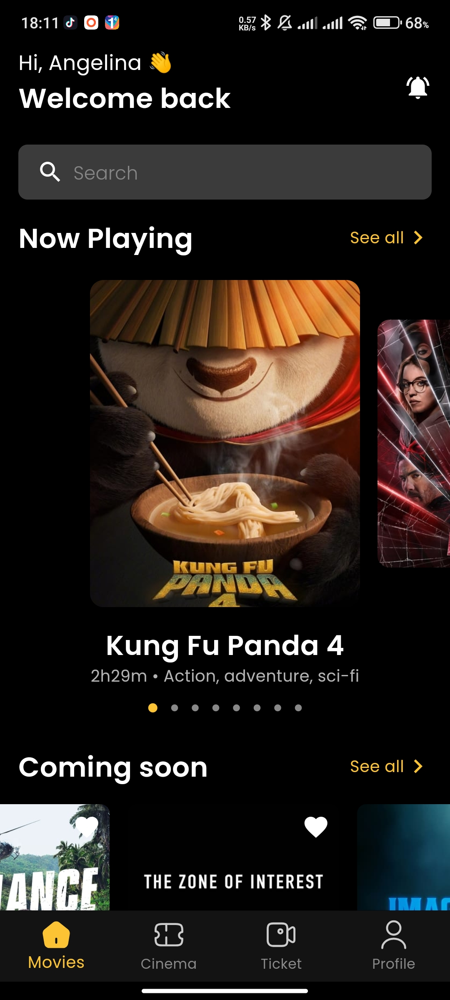
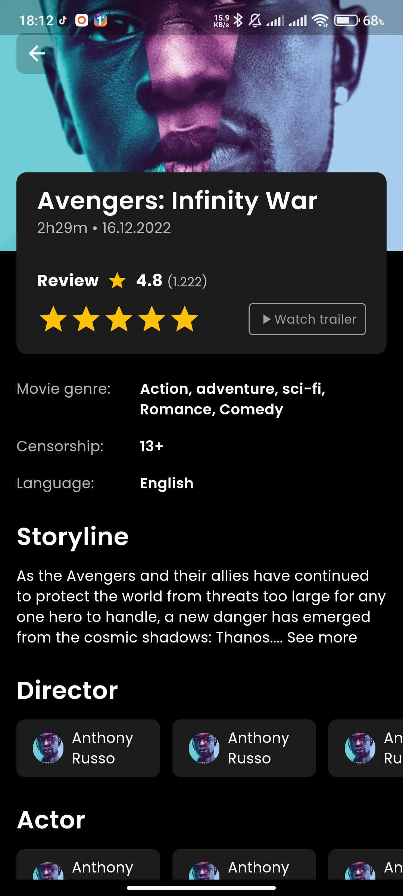
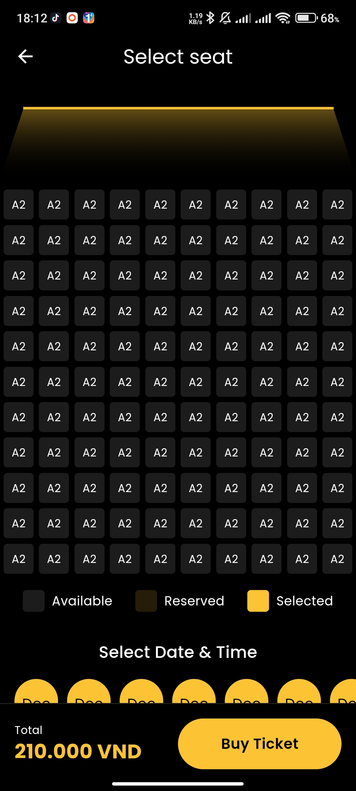

# Movie Booking App (Clean Architecture)

Here is another movie booking app but rewritten in clean architecture with Flutter.

## Tech stack
- [Clean Architecture](https://medium.com/@samra.sajjad0001/flutter-clean-architecture-5de5e9b8d093)
- [Dio](https://pub.dev/packages/dio)
- [Retorfit](https://pub.dev/packages/retrofit)
- [Hive](https://pub.dev/packages/hive)
- [GetX](https://pub.dev/packages/get)
- [Uuid](https://pub.dev/packages/uuid)
- [Chuck](https://pub.dev/packages/chuck_interceptor)
- [Stream Transformer](https://pub.dev/packages/stream_transform)

## Screenshots

<table>
  <tr>
    <td style="padding: 20px">  </td>
    <td style="padding: 20px">  </td>
    <td style="padding: 20px">  </td>
  </tr>
</table>

## Resources
- Movie api (https://developer.themoviedb.org/docs/getting-started)
- Figma Design (https://www.figma.com/file/ND1Gcjv5qqXrTGmTJReGZU/MBooking---Movie-ticket-booking-app-(Community)?type=design&node-id=87-11&mode=design&t=PWauPjr6BK5a4etK-0)

## Getting Started

This project is a starting point for a Flutter application.

A few resources to get you started if this is your first Flutter project:

- [Lab: Write your first Flutter app](https://docs.flutter.dev/get-started/codelab)
- [Cookbook: Useful Flutter samples](https://docs.flutter.dev/cookbook)

For help getting started with Flutter development, view the
[online documentation](https://docs.flutter.dev/), which offers tutorials,
samples, guidance on mobile development, and a full API reference.

